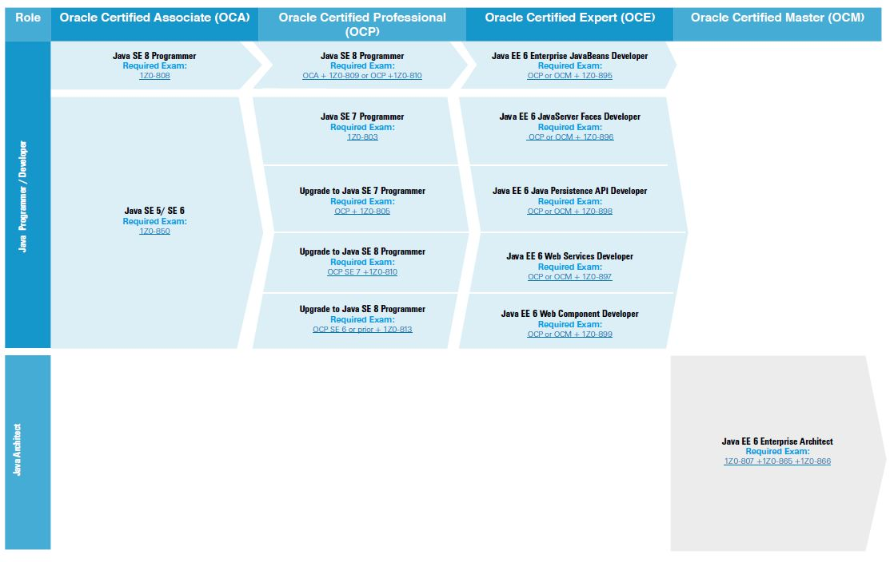

A continuación se muestran los pasos para realizar la certificación de Java:

<h2 pid="19" style="text-align: left;"><strong style="Helvetica Neue&amp;quot;, Helvetica, Arial, sans-serif; font-size: 25px; color: inherit; font-family: &amp;quot;">1. Leer sobre los tipos de certificaciones</strong>&nbsp; &nbsp;</h2>

	<table> 
 <tbody> 
  <tr> 
   <td style="text-align: left;">
Exam Number
</td> 
   <td style="text-align: left;">
Exam

Name
</td> 
   <td style="text-align: left;">
Product

Version
</td> 
   <td style="text-align: left;">
Duration

(minutes)
</td> 
   <td style="text-align: left;">
# of

Questions
</td> 
   <td style="text-align: left;">
Passing

Score
</td> 
   <td style="text-align: left;">
Exam Format
</td> 
  </tr> 
  <tr> 
   <td style="text-align: left;">
1Z0-808
</td> 
   <td style="text-align: left;">
Oracle Certified Associate, Java SE 8 Programmer
</td> 
   <td style="text-align: left;">
SE
</td> 
   <td style="text-align: left;">
150
</td> 
   <td style="text-align: left;">
77
</td> 
   <td style="text-align: left;">
65%
</td> 
   <td style="text-align: left;">
Multiple Choice
</td> 
  </tr> 
  <tr> 
   <td style="text-align: left;">
1Z0-809
</td> 
   <td style="text-align: left;">
Oracle Certified Professional, Java SE 8 Programmer
</td> 
   <td style="text-align: left;">
SE
</td> 
   <td style="text-align: left;">
150
</td> 
   <td style="text-align: left;">
85
</td> 
   <td style="text-align: left;">
65%
</td> 
   <td style="text-align: left;">
Multiple Choice
</td> 
  </tr> 
  <tr> 
   <td style="text-align: left;">
1Z0-897
</td> 
   <td style="text-align: left;">
Oracle Certified Expert, Java EE 6 Web Services Developer
</td> 
   <td style="text-align: left;">
EE
</td> 
   <td style="text-align: left;">
90
</td> 
   <td style="text-align: left;">
55
</td> 
   <td style="text-align: left;">
65%
</td> 
   <td style="text-align: left;">
Multiple Choice
</td> 
  </tr> 
  <tr> 
   <td style="text-align: left;">
1Z0-807
</td> 
   <td style="text-align: left;">
Java EE 6 Enterprise Architect Certified Master
</td> 
   <td style="text-align: left;">
EE
</td> 
   <td style="text-align: left;">
150
</td> 
   <td style="text-align: left;">
60
</td> 
   <td style="text-align: left;">
71%
</td> 
   <td style="text-align: left;">
Multiple Choice
</td> 
  </tr> 
  <tr> 
   <td style="text-align: left;">
1Z0-865
</td> 
   <td style="text-align: left;">
Java (EE) Enterprise Architect Certified Master Assignment
</td> 
   <td style="text-align: left;">
EE
</td> 
   <td style="text-align: left;">
6 months
</td> 
   <td style="text-align: left;">
NA
</td> 
   <td style="text-align: left;">
Validity
</td> 
   <td style="text-align: left;">
Performance Based
</td> 
  </tr> 
  <tr> 
   <td style="text-align: left;">
1Z0-866
</td> 
   <td style="text-align: left;">
Java (EE) Enterprise Architect Certified Master Essay
</td> 
   <td style="text-align: left;">
EE
</td> 
   <td style="text-align: left;">
120
</td> 
   <td style="text-align: left;">
NA
</td> 
   <td style="text-align: left;">
Validity
</td> 
   <td style="text-align: left;">
Essay
</td> 
  </tr> 
 </tbody> 
</table>

<h2 pid="20" style="text-align: left;">2. Leer libros recomendados</h2>
<ul> 
 <li style="text-align: left;">OCA: Oracle Certified Associate Java SE 8 Programmer I Study Guide: Exam 1Z0-808 
  <ul> 
   <li style="text-align: left;">Es conciso y simple, pero no es suficiente para preparar la cerficación.</li> 
   <li style="text-align: left;"><a href="https://www.amazon.com/OCA-Certified-Associate-Programmer-1Z0-808/dp/1118957407/?&amp;&amp;&amp;-4&amp;+Java+SE+8+Programmer" rel="nofollow" target="_blank">Amazon Book Information</a></li> 
  </ul></li> 
 <li style="text-align: left;">OCA Java SE 8 Programmer I Certification Guide 
  <ul> 
   <li style="text-align: left;">Es más detallado y provee más preguntas de exámenes</li> 
   <li style="text-align: left;"><a href="https://www.amazon.com/OCA-Java-Programmer-Certification-Guide/dp/1617293253/?&amp;&amp;-3&amp;+Oracle+Certified+Associate+Java+SE+8+Programmer+I" rel="nofollow" target="_blank">Amazon Book Information</a></li> 
  </ul></li> 
</ul>

<h2 pid="20" style="text-align: left;">3. Aprender las novedades de la última versión de java para la que te vayas a presentar</h2>

<h2 pid="20" style="text-align: left;">4. Resolver exámenes	de ejemplos</h2>

<a href="http://enthuware.com/index.php/mock-exams/oracle-certified-associate/java-oca-certification-8" rel="nofollow" target="_blank">Enthuware's Java 8 SE certification&nbsp;</a> puede ser un buen recurso para realizar preguntas parecidas a la certificación oficial.

<h2 pid="20" style="text-align: left;">5. Registrarse y comprar un Voucher para realizar el examen</h2>

<a href="https://education.oracle.com/pls/web_prod-plq-dad/db_pages.getpage?page_id=5001&amp;get_params=p_exam_id:1Z0-808" rel="nofollow" target="_blank">Oracle Education Exam registration link</a>.

Libros disponibles en el siguiente enlace: 

<a href="https://gitlab.com/kenichi.shibata/book/tree/master/">libros java</a>

